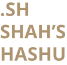

<!-- PROJECT LOGO -->
 

    
  <h3 align="center"></h3>
  

   Bash Script for NJOY2016
  

## About The Project
 Membuat Bash Scripting File untuk menjalankan program NJOY2016, dikarenakan terlalu banyak hal yang harus dilakukan sebelum menjalankan dan atau setelah menjalankan program
 NJOY, maka dari itu, dibuat automasi lewat bash scripting agar mudah, gan. Mempercepat pekerjaan, asik.

### Built With

Data dari pustaka ENDF yang tersedia dari website IAEA NDS :atom: ([https://www-nds.iaea.org/public/download-endf/](https://www-nds.iaea.org/public/download-endf/)).

## Usage

Untuk detail penggunaan dan tata cara bakal ane upload pas lagi ada waktu gabut, gan. Terima kasih.

## Contact

Your Name - [@awwaloppa](https://instagram.com/awwaloppa) - ilham438.ar@mail.ugm.ac.id
